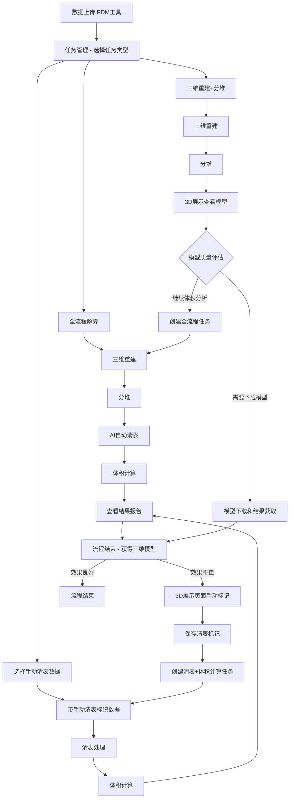

# 天巡散货堆场体积量测系统架构文档

## 系统概述

天巡散货堆场体积量测系统是基于天际航技术平台构建的专业化应用系统，专门用于散货堆场（煤堆、矿堆等）的自动化体积监测和管理。系统采用前后端分离架构，提供灵活的工作流管理和高精度的体积计算能力。

## 一、系统架构

### 1.1 整体架构图

```
┌─────────────────────────────────────────────────────────┐
│                   天巡散货体积量测系统                      │
├─────────────────────────────────────────────────────────┤
│  前端应用层（8个页面模块）                                  │
│  ├─ 仪表盘    ├─ 数据管理   ├─ 任务管理   ├─ 三维展示     │
│  ├─ 结果分析  ├─ 报告管理   ├─ 系统设置   └─ 入口页面     │
├─────────────────────────────────────────────────────────┤
│                    API接口层                            │
├─────────────────────────────────────────────────────────┤
│                天际航技术平台（后台）                        │
│  ├─ 数据管理系统（PDM+云端）                              │
│  ├─ ETE工作流引擎                                       │
│  ├─ AI中心（DPM算法服务）                                │
│  └─ 航迹规划系统（暂不使用）                              │
└─────────────────────────────────────────────────────────┘
```

### 1.2 前端应用层详细说明

#### 页面架构（8个核心模块）

```
前端应用层
├── index.html                    # 系统入口，重定向至仪表盘
├── dashboard.html               # 仪表盘【角色1-宏观监控】全国堆场数据统计
├── data_management.html         # 数据管理，文件上传和数据查询操作
├── task_management.html         # 任务管理，创建和监控各类解算任务
├── 3d_visualization.html        # 三维展示，模型查看和手动清表操作
├── result_analysis.html         # 结果分析【角色2-深度分析】单堆场详细分析
├── report_management.html       # 报告管理，生成和下载各类报告
└── system_settings.html        # 系统设置，参数配置和用户管理
```

#### 核心功能模块

**仪表盘模块（dashboard.html）**
- 角色定位：全国宏观数据监控（角色1）
- 全国各堆场项目概览和关键指标展示
- 多堆场任务执行状态统一监控
- 全国范围数据统计和趋势分析
- 跨堆场对比分析和异常预警
- 快速操作入口和堆场切换

**数据管理模块（data_management.html）**
- 调用PDM工具进行数据上传
- 数据查询和历史记录查看
- 文件状态管理和验证
- 数据备份和恢复

**任务管理模块（task_management.html）**
- 支持多种任务类型创建
- 任务进度实时监控
- 任务历史和日志查看
- 异常处理和重试机制

**三维展示模块（3d_visualization.html）**
- 三维模型可视化展示
- 手动清表标记功能
- 分堆结果查看和验证
- 交互式数据操作

### 1.3 后台处理系统

基于天际航技术平台，包含以下核心组件：

**数据管理系统**
- PDM客户端：本地数据上传工具，支持断点续传
- 云端存储：海量数据存储和管理
- 数据API：提供统一的数据查询和操作接口

**ETE工作流引擎**
- 三维重建：点云生成和模型构建
- 分堆算法：3D点云分割和堆体识别
- 清表处理：目标检测和模型修饰
- 体积计算：空间几何计算和精度验证

**AI中心**
- DPM分堆算法服务：智能堆体分割
- DPM自动清表算法服务：干扰物智能识别和清理
- 持续学习和模型优化

## 二、工作流体系

### 2.1 任务类型设计

系统支持三种灵活的任务类型，满足不同场景需求：

| 任务类型 | 包含步骤 | 适用场景 | 核心特点 |
|---------|---------|---------|---------|
| 全流程解算 | 三维重建 → 分堆 → 清表 → 体积计算 | 标准场景，AI清表效果良好 | 端到端自动化处理 |
| 清表+体积计算 | 按清表标记剔除 → 体积计算 | 需要手动清表修正的场景 | 复用三维模型，提高效率 |
| 三维重建+分堆 | 三维重建 → 分堆 | 用户需要云端算力进行三维重建并下载模型 | 利用云端高性能计算资源 |

### 2.2 工作流程图



### 2.3 详细工作流程

**流程一：全流程自动执行（标准场景）**
1. 数据上传
   └── 通过PDM工具上传航拍影像数据
2. 创建全流程任务
   └── 在任务管理页面选择"全流程解算"
3. 自动执行四步流程
   ├── 三维重建：生成点云和三维模型
   ├── 分堆：3D点云分割，识别独立堆体
   ├── 清表：AI自动识别和清理干扰物
   └── 体积计算：精确计算各堆体体积
4. 结果验证
   └── 查看结果报告，检查清表效果

**流程二：手动清表修正（异常处理场景）**
1. 发现清表问题
   └── 全流程执行后，发现土堆、沙堆等未被正确清理
2. 手动清表标记
   ├── 进入三维展示页面
   ├── 对未清理区域进行手动标记
   └── 保存清表标记数据
3. 重新处理
   ├── 创建"清表+体积计算"任务
   ├── 选择带有手动标记的数据
   └── 执行清表和体积计算
4. 获得修正结果
   └── 查看基于手动清表的准确体积报告

**流程三：云端三维重建（云算力服务场景）**
1. 数据上传和任务创建
   ├── 用户上传无人机影像数据
   └── 创建"三维重建+分堆"任务
2. 云端高性能处理
   ├── 利用云端GPU/CPU集群进行三维重建
   ├── 生成高精度点云和三维模型
   └── 执行智能分堆处理
3. 结果查看和下载
   ├── 在3D展示页面预览三维模型效果
   ├── 下载点云文件(.las)和三维模型(.obj/.ply等)
   └── 获取分堆结果数据
4. 后续选择
   ├── 仅需要三维模型 → 流程结束，获得重建结果
   └── 需要体积分析 → 继续创建全流程任务进行清表和体积计算

## 三、核心技术特性

### 3.1 灵活性设计
- 流程可拆解：支持从任意中间步骤开始处理
- 结果可复用：三维重建结果可多次使用，避免重复计算
- 人工干预：关键节点支持人工检查和修正

### 3.2 智能化处理
- AI自动清表：智能识别和清理非目标物体
- 3D智能分堆：基于点云特征的堆体自动分割
- 质量自动评估：处理结果自动验证和异常检测

### 3.3 用户体验优化
- 可视化操作：三维场景中的直观交互操作
- 进度透明化：实时显示任务执行进度和状态
- 异常处理友好：清晰的异常提示和解决方案指导

## 四、数据流和接口规范

### 4.1 数据流转路径
原始航拍数据 → PDM上传 → 云端存储 → ETE处理 → AI分析 → 结果存储 → 前端展示

### 4.2 关键接口规范

```yaml
# 任务管理接口
POST /api/task/create
  - type: "full_process" | "cleanup_volume" | "reconstruction_segment"
  - data_id: 数据标识
  - parameters: 处理参数

GET /api/task/{id}/status
  - 返回任务执行状态和进度

# 三维展示接口 
GET /api/3d/model/{data_id}
  - 获取三维模型数据

POST /api/3d/markup
  - 保存手动清表标记

# 结果查询接口
GET /api/result/{task_id}
  - 获取体积计算结果和报告
```

## 五、系统优势

### 5.1 业务价值
- 精度保障：多层质量控制，确保体积计算准确性
- 效率提升：自动化处理大幅减少人工工作量
- 灵活应对：多种工作流适应不同场景需求

### 5.2 技术优势
- 成熟平台：基于天际航成熟技术平台构建
- 模块化设计：组件独立，易于维护和扩展
- 智能化程度高：AI驱动的核心处理环节

### 5.3 用户体验
- 操作简单：直观的Web界面，学习成本低
- 可视化强：三维场景直观展示处理结果
- 异常处理完善：友好的错误提示和修正机制

## 六、用户角色和权限设计

### 6.1 角色分级体系

**角色1：宏观监控用户（全国视角）**
- 主要界面：仪表盘（dashboard.html）
- 权限范围：
  - 查看全国所有堆场的汇总数据
  - 监控各堆场任务执行状态
  - 跨堆场数据对比分析
  - 全国范围异常预警查看
- 典型用户：总部管理人员、区域负责人、数据分析师

**角色2：详细分析用户（单堆场视角）**
- 主要界面：结果分析（result_analysis.html）
- 权限范围：
  - 深入分析指定堆场的详细数据
  - 查看单堆场历史变化趋势
  - 进行堆体分布和材料统计
  - 执行质量分析和精度评估
- 典型用户：现场操作人员、堆场管理员、技术分析师

### 6.2 数据展示差异化

| 功能维度 | 角色1：仪表盘 | 角色2：结果分析 |
|---------|-------------|--------------|
| 数据范围 | 全国多堆场汇总 | 单个堆场详细 |
| 统计粒度 | 宏观趋势指标 | 微观精准数据 |
| 时间维度 | 月度/季度/年度 | 日度/周度/月度 |
| 分析深度 | 概览性分析 | 深度专业分析 |
| 操作权限 | 监控查看为主 | 分析操作并重 |

---

*本文档版本：v2.0，更新时间：2025年8月*  
*基于天际航技术平台构建，专为散货堆场体积监测优化*